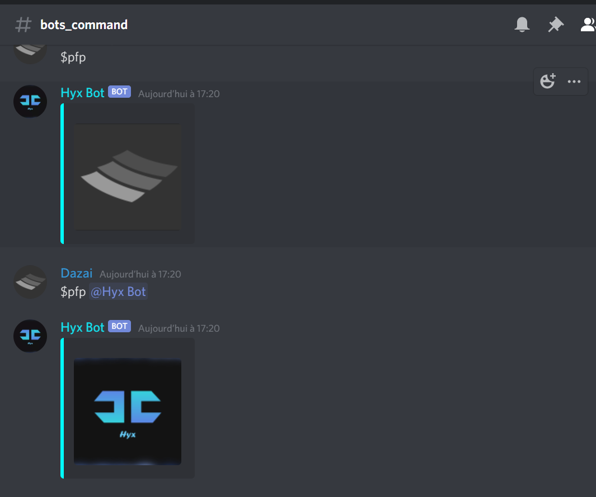
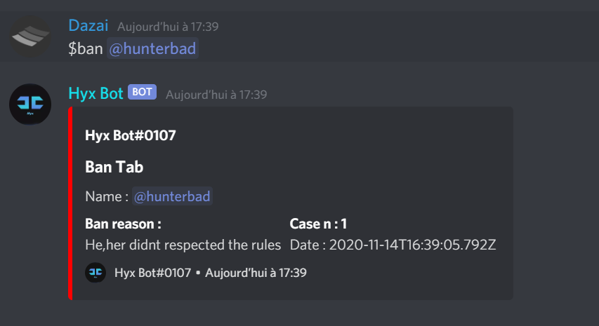
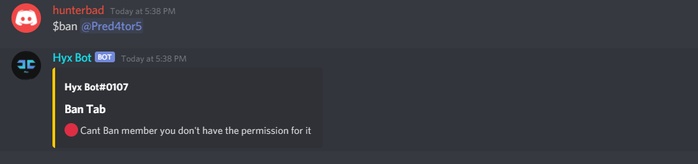
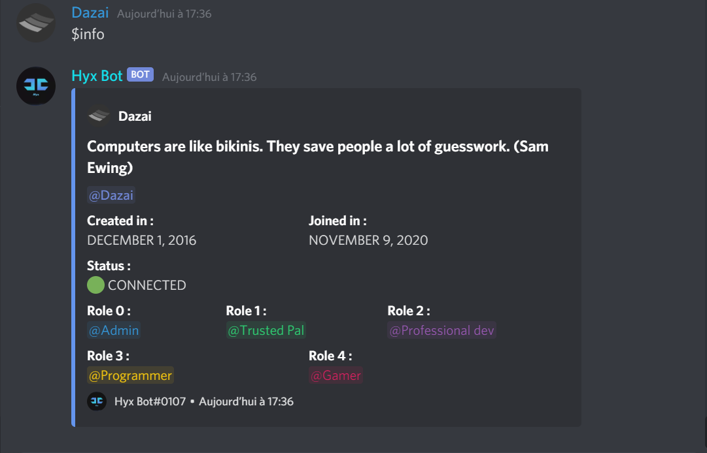
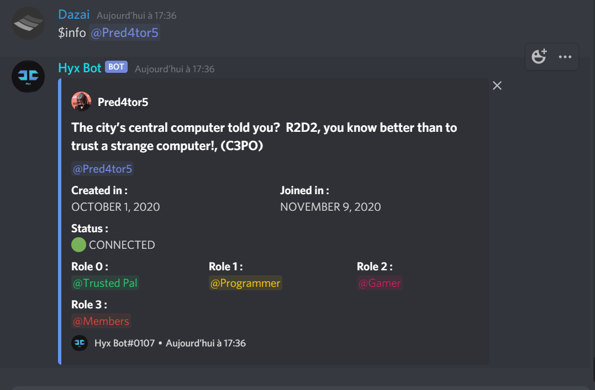
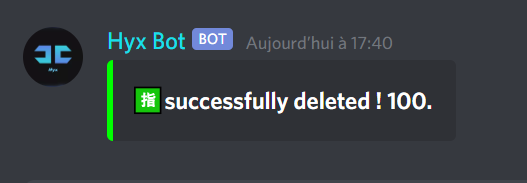

# Hyx-bot
Discord bot made in Java
# Command : 
## Prefix $ 
<b>$pfp(@mentionuser) :</b> 
show the profile picture of the user you can mentionuser and get their pfp 

<b>$kick (@mentionuser) :</b> 
kick an user from the serv you need to set the permission to kick to on

<b>$ban (@mentionuser) :</b> 
ban an user from the serv you need to set up the permission to ban

<b>$info (@mentionuser) :</b> 

show info about user or mentioneduser

<b>$clear (number) :</b> 
clear message max = 100 ; min = 2

<b>$invite : </b> 
invite message for bot

<b>$ping : </b> 
ping ms

